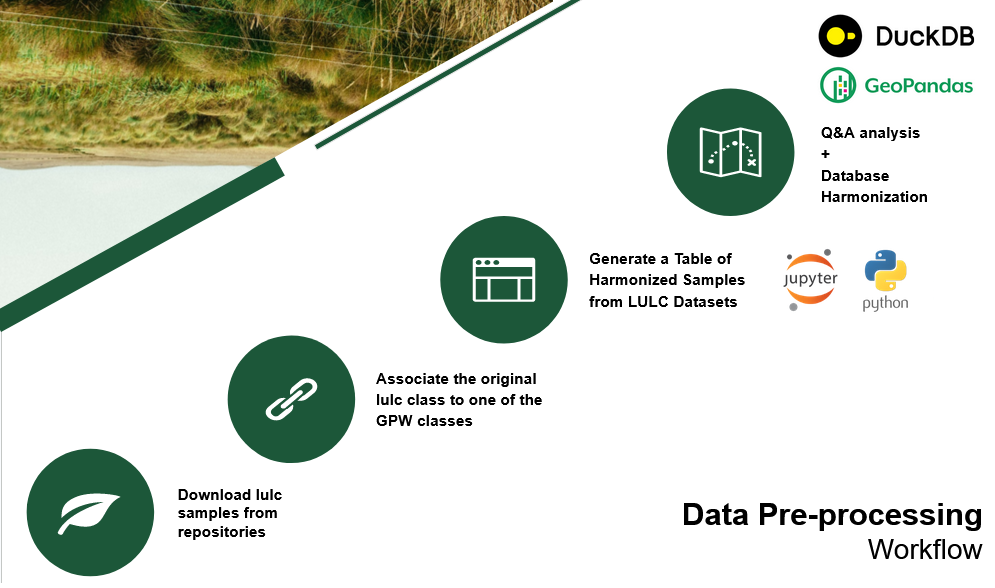

# Integrated Approach to Global Land Use and Land Cover Reference Data Harmonization
[](https://creativecommons.org/licenses/by-sa/4.0/)

Harmonization of global reference samples and EO/gridded datasets, aligning with GPW classes, to optimize their integration into the GPW machine learning workflow 
.
This work is licensed under a
[Creative Commons Attribution-ShareAlike 4.0 International License][cc-by-sa].


This work only includes vector data in Geoparquet and geopackage format

**For any questions, please refer to our [FAQs](https://github.com/maja601/EuroCrops/wiki/FAQs) or use the Discussions/Issues to reach out to us.**

***
## Content

1. [Workflow](#workflow)
2. [Hamonisation data](#harmonsiation)
3. [Datasets used](#Datasets_used)
4. [GitHub project structure](#github_structure)
5. [Download data](#download_data)
6. [Reference](#reference)


***
## Workflow <a name="workflow"></a>



## Hamonisation data <a name="harmonsiation"></a>
We need to consider reference samples derived by visual interpretation with a spatial support of at least 30-m (Landsat and Sentinel), able to represent LULC classes for a point or region. For every dataset, we need to have automated script (Python, R or computational notebook) to download the vector files and convert existing LULC classes the Global Pasture Watch Project into:
  - Seeded grass,        
      
  - Natural or Semi-natural grass,
     
  - Other, and

  - Crops and other related agricultural practices 

The land use and land cover (LULC) classes from the original databases were related to the use classes of the Global Pasture Watch project through the class definitions of the original database. 

This example the column in output harmonization data


| Attribute Name | Definition                                                |
| -------------- | ----------------------------------------------------------- |
| dataset_name     | The name of original dataset LULC|
| reference_year | The reference year of samples the orginal dataset.|
| original_lulc_class      | Name classe land use and land cover the original dataset. |
| gpw_lulc_class      | Name classe land use and land cover the Global Pasture Watch project. |
| sample_weight      | The sample weight   |

## Datasets used <a name="Datasets_used"></a>

In this work, the following databases were used:
- [CONUS Validation samples (U.S)](https://www.usgs.gov/special-topics/lcmap/lcmap-conus-reference-data)
- [MapBiomas samples (Brazil)](https://zenodo.org/record/5136666#.ZEE08HpBwXc)
- [LUCAS samples (Europe)](https://data.jrc.ec.europa.eu/dataset/f85907ae-d123-471f-a44a-8cca993485a2)
- [GeoWiki samples (Global)](https://doi.pangaea.de/10.1594/PANGAEA.869680?format=html#download)
- [PREDICTS database samples (Global)](https://data.nhm.ac.uk/dataset/the-2016-release-of-the-predicts-database)
- [WorldCereal samples (Global)](https://zenodo.org/communities/worldcereal-rdm?page=1&size=20)
- [DynamicWorld Samples (Global)](https://doi.pangaea.de/10.1594/PANGAEA.933475)
- [CropHarvest samples (Global)](https://github.com/nasaharvest/cropharvest)
- [EuroCrops Samples](https://github.com/maja601/EuroCrops)


## GitHub project structure <a name="github_structure"></a>
```
├──ipynb
│     └── Code in jupyter notebook from python
├──harmonized_datasets
      └── data_processed_qa
          └──vector file
                ├──parquet
                    └── Link to parquet file
      └── raw data
          └──vector file
                ├──parquet
                    └── Link to parquet file
                
```


## Download data<a name="Download_data"></a>

The vector data is now available via [google drive de project](https://drive.google.com/drive/folders/1jEx2ey0JScP7vZDvLSNxOgiskGOO3sCd).


## Reference<a name="reference"></a>

**Disclaimer**: Please reference the dataset dependent source in case you're using their data.


[![CC BY-SA 4.0][cc-by-sa-image]][cc-by-sa]

[cc-by-sa]: http://creativecommons.org/licenses/by-sa/4.0/
[cc-by-sa-image]: https://licensebuttons.net/l/by-sa/4.0/88x31.png
[cc-by-sa-shield]: https://img.shields.io/badge/License-CC%20BY--SA%204.0-lightgrey.svg
